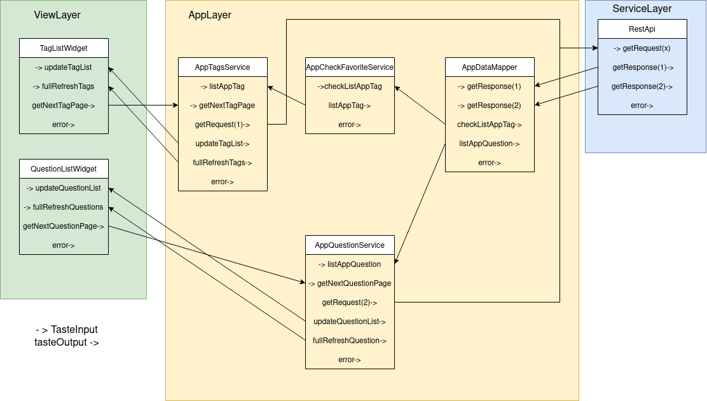

# stackoverflow_reader
A project to test the Tastypie architecture. Allows you to read tags and tag questions from the Stackoverflow API

## Chain event

## TODO 
- [ ] Send Error to ScaffoldMessenger
- [ ] Send Error msg from restapi service to consumer for refresh request